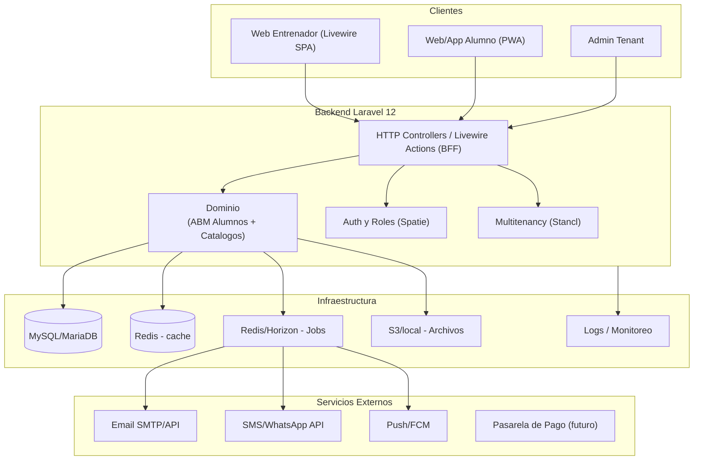

```mermaid
flowchart TB

%% ===== Clients =====
subgraph Clients[Clientes]
  direction TB
  TWeb["Web Entrenador (Livewire SPA)"]
  AWeb["Web/App Alumno (PWA)"]
  Admin["Admin Tenant"]
end

%% ===== Backend App =====
subgraph App[Backend Laravel 12]
  direction TB
  Controllers["HTTP Controllers / Livewire Actions (BFF)"]
  Domain["Dominio\n(ABM Alumnos + Catalogos)"]
  Auth["Auth y Roles (Spatie)"]
  Tenancy["Multitenancy (Stancl)"]
end

%% ===== Infraestructure =====
subgraph Infra[Infraestructura]
  DB[(MySQL/MariaDB)]
  Cache[(Redis - cache)]
  Queue["Redis/Horizon - Jobs"]
  Storage["S3/local - Archivos"]
  Log["Logs / Monitoreo"]
end

%% ===== External Services =====
subgraph Ext[Servicios Externos]
  Mail["Email SMTP/API"]
  SMS["SMS/WhatsApp API"]
  Push["Push/FCM"]
  Pay["Pasarela de Pago (futuro)"]
end

%% ===== Relaciones =====
TWeb --> Controllers
AWeb --> Controllers
Admin --> Controllers

Controllers --> Domain
Controllers --> Auth
Controllers --> Tenancy

Domain --> DB
Domain --> Storage
Domain --> Cache
Domain --> Queue

Queue --> Mail
Queue --> SMS
Queue --> Push

App --> Log

```
