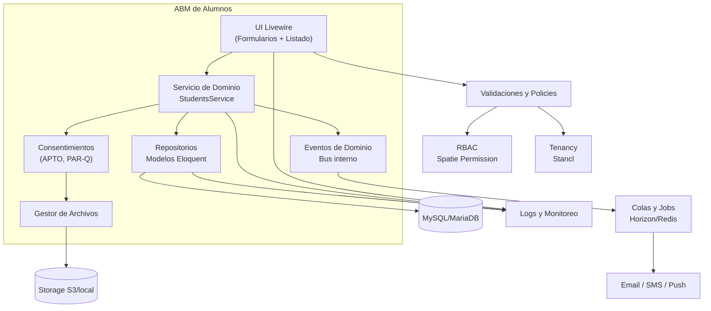

```mermaid
flowchart TB

%% ===== ABM de Alumnos (detalle de capas y flujos) =====
subgraph ABM[ABM de Alumnos]
  direction TB
  UI["UI Livewire\n(Formularios + Listado)"]
  Svc["Servicio de Dominio\nStudentsService"]
  Repo["Repositorios\nModelos Eloquent"]
  Files["Gestor de Archivos"]
  Consent["Consentimientos\n(APTO, PAR-Q)"]
  Events["Eventos de Dominio\nBus interno"]
end

%% ===== Cross-cutting =====
Val["Validaciones y Policies"]
RBAC["RBAC\nSpatie Permission"]
Ten["Tenancy\nStancl"]
DB[(MySQL/MariaDB)]
Media[(Storage S3/local)]
Queue["Colas y Jobs\nHorizon/Redis"]
Mail["Email / SMS / Push"]
Log["Logs y Monitoreo"]

%% ===== Relaciones principales =====
UI --> Val
Val --> RBAC
Val --> Ten

UI --> Svc
Svc --> Repo
Repo --> DB

Svc --> Consent
Consent --> Files
Files --> Media

Svc --> Events
Events --> Queue
Queue --> Mail

%% ===== Observabilidad =====
UI --> Log
Svc --> Log
Repo --> Log


```
