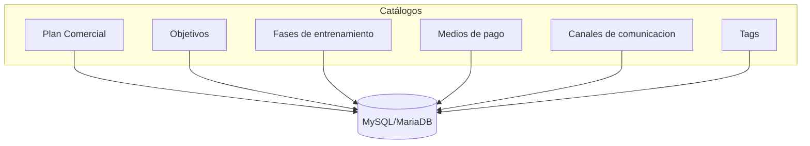

```mermaid
flowchart TB

%% ===== Catálogos mínimos =====
subgraph Catalogs[Catálogos]
  PCat["Plan Comercial"]
  Obj["Objetivos"]
  Fase["Fases de entrenamiento"]
  Medio["Medios de pago"]
  Canal["Canales de comunicacion"]
  Tags["Tags"]
end

%% ===== Infra =====
DB[(MySQL/MariaDB)]

%% ===== Relaciones =====
PCat --> DB
Obj --> DB
Fase --> DB
Medio --> DB
Canal --> DB
Tags --> DB

```
