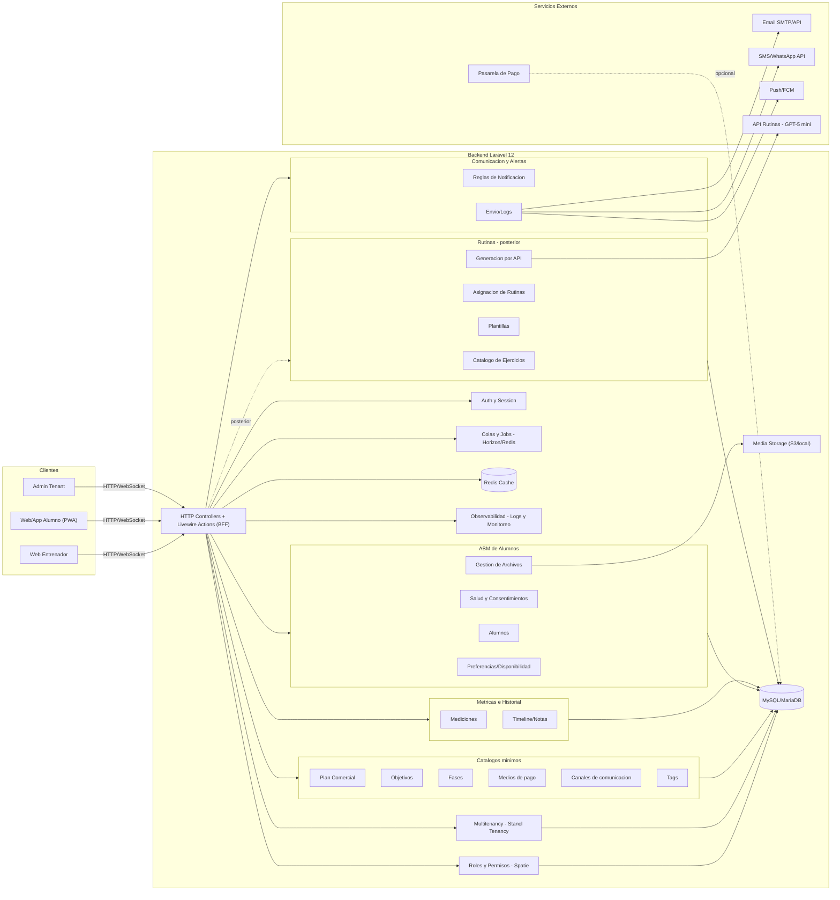

```mermaid
flowchart LR

%% ===================== Clients =====================
subgraph Clients[Clientes]
  TWeb["Web Entrenador"]
  AWeb["Web/App Alumno (PWA)"]
  Admin["Admin Tenant"]
end

%% ===================== Backend =====================
subgraph App[Backend Laravel 12]
  direction TB

  API["HTTP Controllers + Livewire Actions (BFF)"]
  Auth["Auth y Session"]
  Tenancy["Multitenancy - Stancl Tenancy"]
  RBAC["Roles y Permisos - Spatie"]

  subgraph Catalogs[Catalogos minimos]
    PCat["Plan Comercial"]
    Obj["Objetivos"]
    Fase["Fases"]
    Medio["Medios de pago"]
    Canal["Canales de comunicacion"]
    Tags["Tags"]
  end

  subgraph Students[ABM de Alumnos]
    Alum["Alumnos"]
    Salud["Salud y Consentimientos"]
    Archivos["Gestion de Archivos"]
    Prefs["Preferencias/Disponibilidad"]
  end

  subgraph Metrics[Metricas e Historial]
    Meds["Mediciones"]
    TimeL["Timeline/Notas"]
  end

  %% encabezado sin parentesis para compatibilidad amplia
  subgraph Workouts[Rutinas - posterior]
    ExCat["Catalogo de Ejercicios"]
    Asig["Asignacion de Rutinas"]
    Plant["Plantillas"]
    GenAI["Generacion por API"]
  end

  subgraph Notif[Comunicacion y Alertas]
    Rules["Reglas de Notificacion"]
    Send["Envio/Logs"]
  end

  Media["Media Storage (S3/local)"]
  Queue["Colas y Jobs - Horizon/Redis"]
  Cache[(Redis Cache)]
  DB[(MySQL/MariaDB)]
  Log["Observabilidad - Logs y Monitoreo"]
end

%% ===================== Integraciones externas =====================
subgraph Ext[Servicios Externos]
  Mail["Email SMTP/API"]
  SMS["SMS/WhatsApp API"]
  Pay["Pasarela de Pago"]
  Push["Push/FCM"]
  AI["API Rutinas - GPT-5 mini"]
end

%% ===================== Flujos principales =====================
TWeb -- HTTP/WebSocket --> API
AWeb -- HTTP/WebSocket --> API
Admin -- HTTP/WebSocket --> API

API --> Auth
API --> Tenancy
API --> RBAC

API --> Catalogs
API --> Students
API --> Metrics
API -. posterior .-> Workouts
API --> Notif

%% ===================== Persistencia =====================
Catalogs --> DB
Students --> DB
Metrics --> DB
Workouts --> DB
RBAC --> DB
Tenancy --> DB

%% ===================== Infra =====================
API --> Cache
API --> Queue
Archivos --> Media

%% ===================== Notificaciones/Integraciones =====================
Send --> Mail
Send --> SMS
Send --> Push
Pay -. opcional .-> DB
GenAI --> AI

%% ===================== Observabilidad =====================
API --> Log
```
